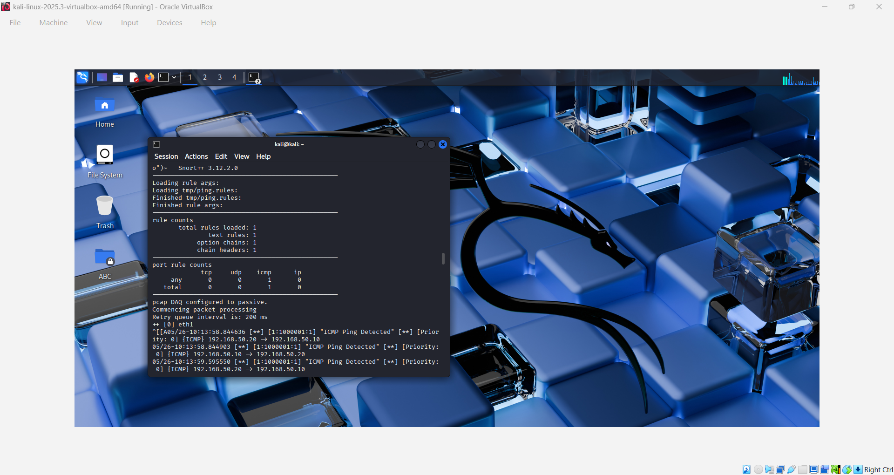
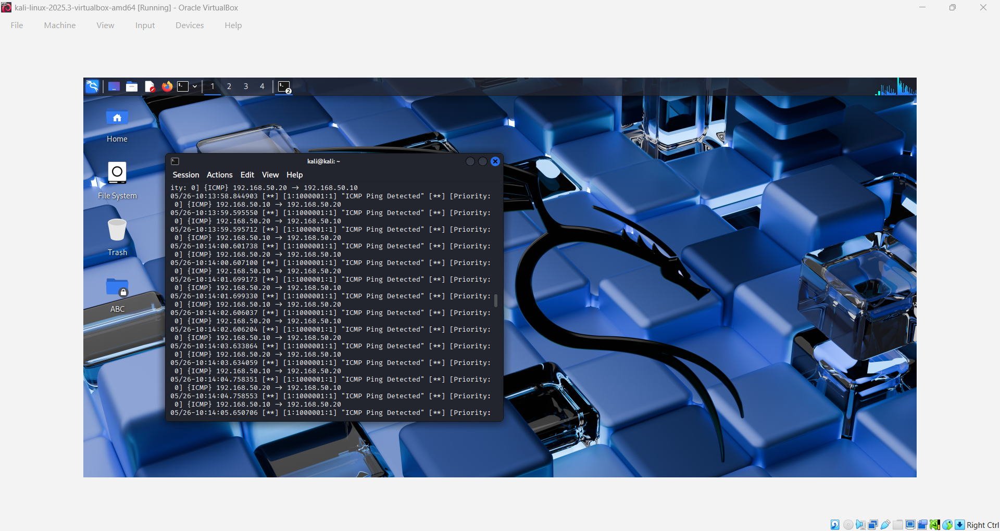

# 🛡️ IDS and ACL Security

## 📖 Project Overview

This project demonstrates the implementation of Intrusion Detection System (IDS) monitoring using Snort together with Access Control Lists (ACLs) to detect and control network traffic within a controlled CyberLab environment.

The investigation focused on detecting ICMP traffic using custom Snort rules and validating security controls designed to restrict unauthorized network communication.

---

## 🎯 Objectives

- Configure Snort IDS
- Create a custom Snort detection rule
- Detect ICMP traffic
- Analyse IDS alerts
- Validate network security controls
- Understand the relationship between detection and prevention

---

## 🛠 Technologies Used

- Kali Linux
- Snort IDS
- Oracle VirtualBox
- Cisco Packet Tracer
- Extended Access Control Lists (ACLs)

---

## 🖥️ Lab Environment

The laboratory consisted of a Kali Linux monitoring workstation configured with Snort IDS together with a Packet Tracer network used to validate Access Control List configurations.

The environment simulated both traffic detection and traffic control mechanisms commonly implemented within enterprise networks.

---

## 🔐 Security Controls Implemented

The following security controls were implemented during this project:

- Snort Intrusion Detection System (IDS)
- Custom ICMP detection rule
- Extended Access Control Lists (ACLs)
- Traffic monitoring and alert generation
- Network traffic validation

These controls demonstrate the layered approach commonly used within enterprise environments, where monitoring and access control work together to improve network security.

---

## 🚨 Intrusion Detection using Snort

Snort was configured to monitor network traffic and generate alerts when ICMP packets matched the custom detection rule.

The successful alert confirmed that the IDS correctly inspected network traffic and identified activity matching the configured signature.

---

## 📡 ICMP Detection

ICMP traffic was generated between hosts to validate the configured detection rule.

The resulting alert confirmed that Snort successfully detected the traffic and recorded the event for further analysis.

---
