# Secure VLAN Network

---

# Project Information

**Project Name:** Secure VLAN Network

**Platform:** Cisco Packet Tracer 8.x

**Category:** Network Security

**Status:** ✅ Completed

**Difficulty:** Intermediate

---

# Project Overview

This project demonstrates the implementation of a secure enterprise switched network using Cisco Packet Tracer.

The primary objective was to segment the network using VLANs, implement secure switch configurations, configure SSH for secure remote management, apply Access Control Lists (ACLs), enable Port Security, and monitor network activity using a Syslog server.

The project forms part of my cybersecurity practical training and focuses on secure network administration and defence.

---

# Objectives

- Configure multiple VLANs
- Configure trunk links
- Verify VLAN communication
- Implement Access Control Lists (ACLs)
- Configure Port Security
- Configure SSH Version 2
- Encrypt device passwords
- Configure Syslog logging
- Verify secure network operation

---

# Technologies Used

- Cisco Packet Tracer
- Cisco IOS
- VLANs
- IEEE 802.1Q Trunking
- Access Control Lists (ACL)
- Port Security
- SSH Version 2
- Syslog
- IPv4 Networking

---

# Network Design

The network was designed to demonstrate secure VLAN implementation within an enterprise environment while maintaining connectivity between remote LANs.

The topology consists of:

- Four Cisco 2911 routers
- Five Cisco 2960 switches
- Multiple end-user PCs
- Separate VLANs for different departments
- Redundant WAN links between routers
- Secure remote administration using SSH

The network was segmented to improve security, reduce unnecessary broadcast traffic and enforce communication policies using Access Control Lists.

## Network Topology

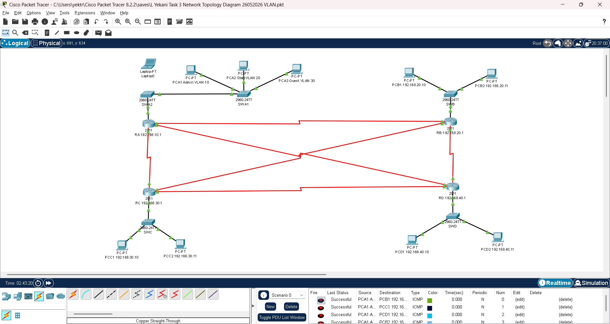

The topology shows:

- VLAN 10 – Administration
- VLAN 20 – Staff
- VLAN 30 – Guest
- Four interconnected routers
- WAN serial links
- Remote branch networks

---

# VLAN Configuration

Virtual Local Area Networks (VLANs) were implemented to logically separate departments within the enterprise network.

Network segmentation improves security by limiting broadcast domains and controlling communication between user groups.

The following VLANs were created:

| VLAN | Department | Purpose |
|------|------------|---------|
| 10 | Administration | Administrative users |
| 20 | Staff | Internal staff network |
| 30 | Guest | Restricted guest access |

## VLAN Verification

The VLAN database was verified after configuration to ensure each VLAN had been successfully created and assigned to the correct switch ports.

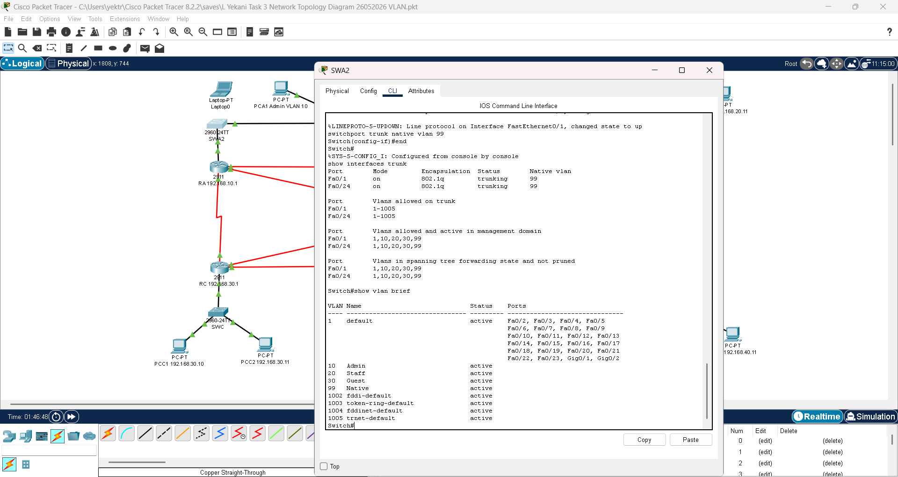

The VLAN verification confirmed that:

- VLANs were successfully created
- Ports were assigned correctly
- Department separation was achieved
- Switch configuration matched the network design

---

# Trunk Configuration

Trunk links were configured using IEEE 802.1Q encapsulation to transport traffic for multiple VLANs between switches.

This allows VLAN traffic to traverse the network while maintaining logical separation between departments.

## Trunk Verification

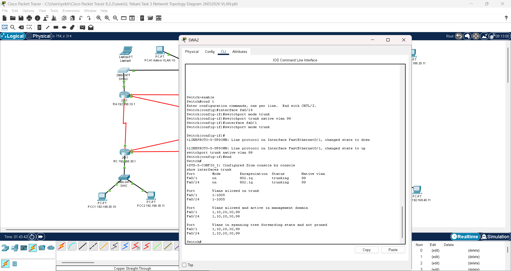

The trunk configuration confirmed:

- Trunk ports were operational
- VLAN traffic was successfully carried between switches
- Multiple VLANs shared a single physical connection
- Network segmentation remained intact

---

# Security Controls

Network security was strengthened through the implementation of multiple security mechanisms designed to protect network devices, restrict unauthorized access and improve monitoring.

The following security controls were implemented:

- Port Security
- SSH Version 2
- Encrypted Passwords
- Syslog Logging
- Access Control Lists (ACLs)

These controls work together to improve the confidentiality, integrity and availability of the network.

## Port Security

Port Security was configured on access ports to prevent unauthorized devices from connecting to the network.

Security violations were configured to restrict access when an unknown MAC address was detected.

### Port Security Configuration

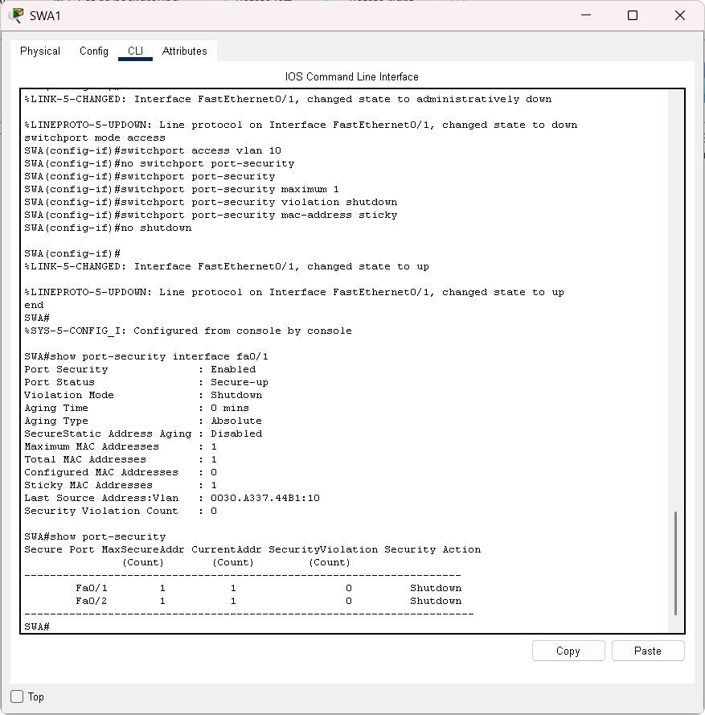

### Port Security Violation Setup

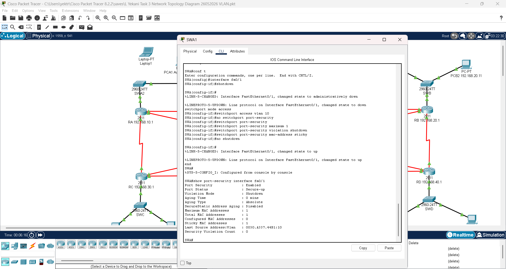

### Verification

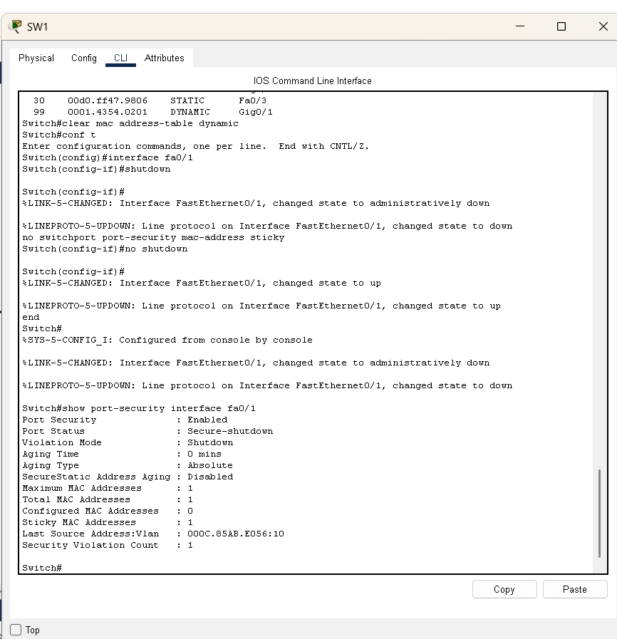

The verification confirmed that the configured security policy correctly detected and responded to unauthorized devices.

---

## Secure Remote Administration (SSH)

Secure Shell (SSH) Version 2 was configured to allow encrypted remote administration of network devices.

This provides a secure alternative to Telnet by encrypting management traffic.

### SSH Enabled

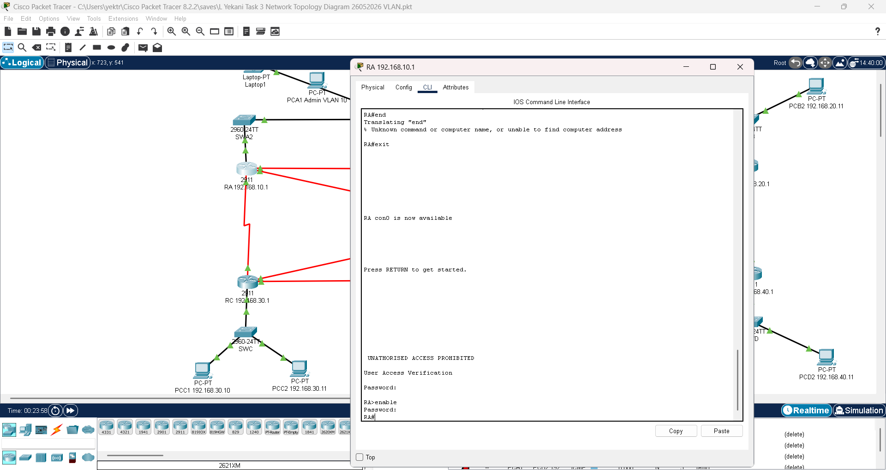

### SSH Version 2 Verification

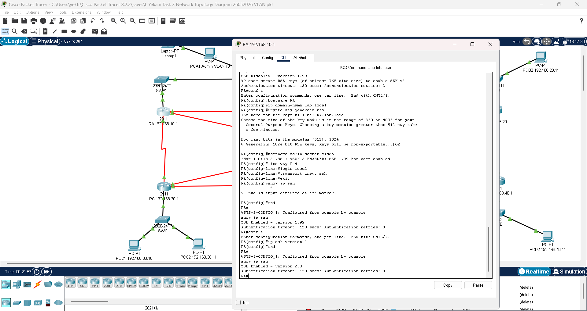

The successful verification confirmed that encrypted remote management was operational.

---

## Password Encryption

Device passwords were encrypted to prevent plaintext credentials from appearing in the running configuration.

### Verification

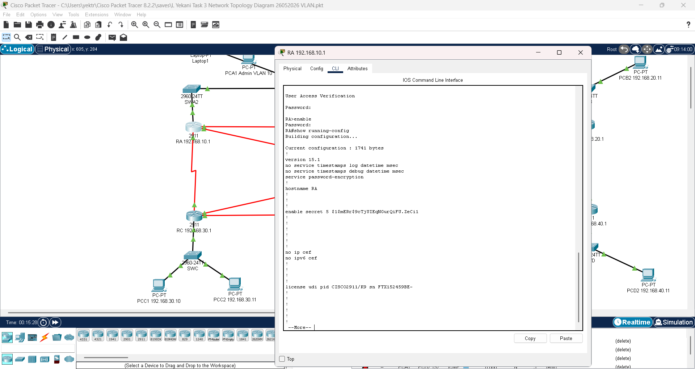

The configuration confirmed that password encryption was successfully enabled on the network devices.

---

# 📋 Syslog Monitoring

To improve network monitoring and troubleshooting, a Syslog server was configured to collect log messages generated by Cisco routers and switches.

The devices were configured to forward important events to the Syslog server, allowing administrators to centrally monitor security events, configuration changes and interface status.

### Verification

The screenshot below confirms that log messages were successfully received by the Syslog server.

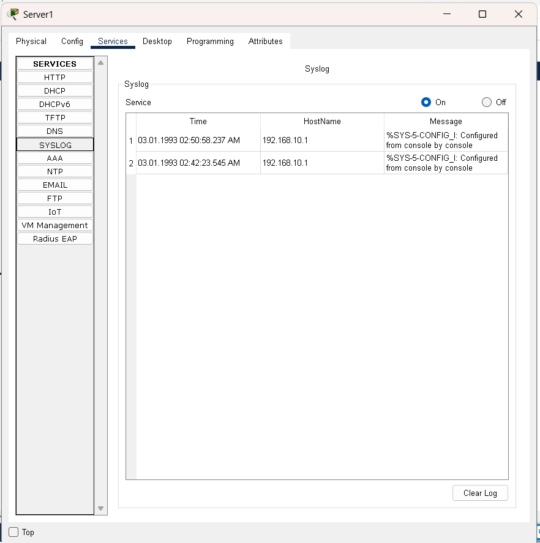

**Outcome**

- Centralized event logging configured
- Devices successfully transmitted log messages
- Enables easier troubleshooting and auditing

---

# 🚫 Access Control Lists (ACL)

Standard Access Control Lists (ACLs) were implemented to restrict communication between selected VLANs.

The ACL was applied to prevent Guest VLAN devices from accessing the Admin VLAN while allowing legitimate traffic elsewhere in the network.

### ACL Verification

The screenshot below shows traffic being successfully blocked according to the configured ACL.

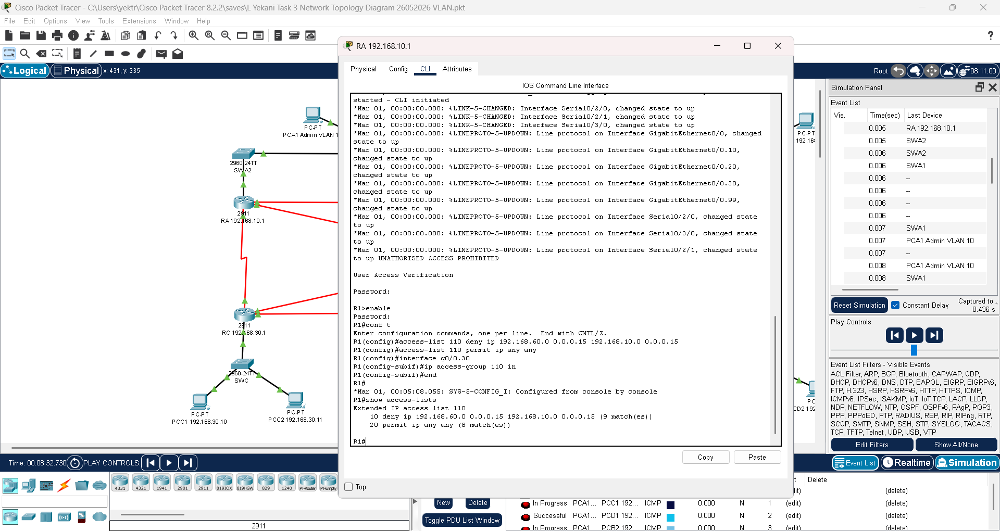

To verify the ACL, an ICMP ping was attempted after the ACL was applied.

The ping request failed as expected, confirming that the ACL was functioning correctly.

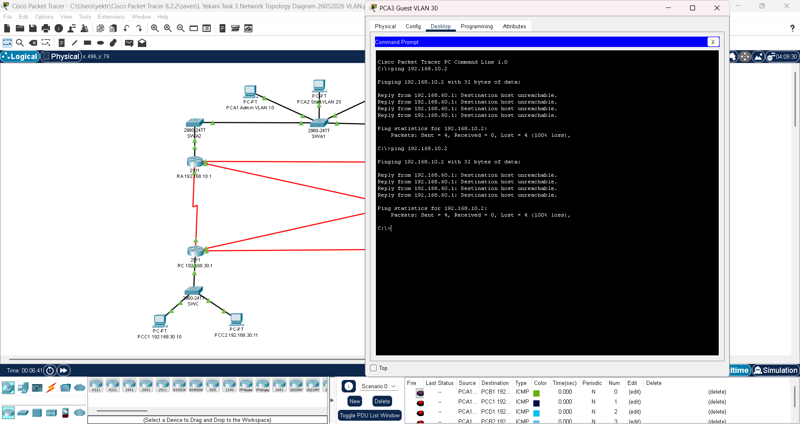

**Outcome**

- Guest VLAN successfully isolated
- Unauthorized communication prevented
- ACL policy successfully verified

---

# 🛠 Skills Demonstrated

Throughout this project the following networking and cybersecurity skills were demonstrated:

- VLAN creation and management
- Switch trunk configuration
- Inter-VLAN routing concepts
- Port Security implementation
- Secure MAC address learning
- SSH remote administration
- Password encryption
- Syslog server configuration
- Standard Access Control Lists (ACLs)
- Cisco IOS configuration
- Network troubleshooting
- Enterprise network documentation

---

# 📁 Project Files

This project contains:

- README.md
- REPORT.md
- Secure-VLAN-Network.pkt
- Router and Switch running configurations
- Network screenshots

---

# 🎓 Lessons Learned

This project provided practical experience in implementing secure enterprise network infrastructure using Cisco Packet Tracer.

Key lessons included:

- Designing VLAN-based networks
- Implementing secure switch configurations
- Configuring trunk links
- Applying Port Security
- Securing remote management using SSH
- Configuring centralized Syslog monitoring
- Implementing and testing ACLs
- Documenting enterprise networking projects using GitHub

The project strengthened both networking and cybersecurity skills while reinforcing industry best practices for secure network administration.
